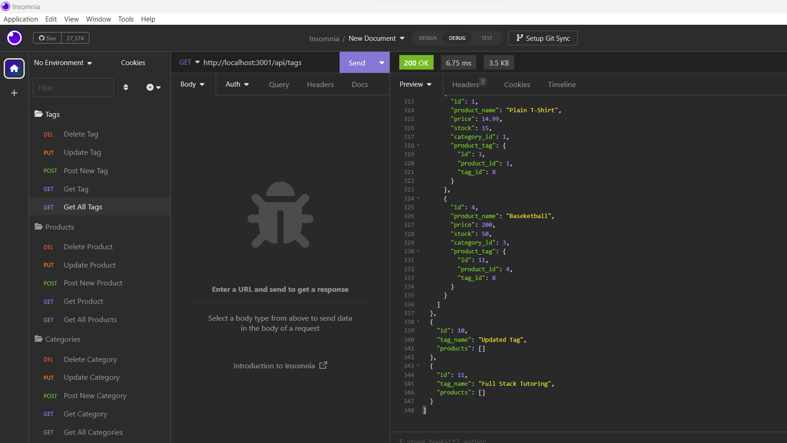

# E-Commerce Back End 

## Description
A back end for an e-commerce site.

## Screenshot of Application

## Table of Contents
- [Installation](#Installation)
- [Usage](#Usage)
- [License](#License)
- [Contributing](#Contributing)
- [Tests](#Tests)
- [Questions](#Questions)
## Installation
Type "npm start" on the Terminal command line.
## Usage
Open the Terminal in VS Code, run "npm i". Type "mysql -u root -p", to get into MySQL shell. Run "source schema.sql" and then "source seeds.sql" from the command line. 

Go back to Bash in the Terminal and type "npm start" to run the app. Server routes can be tested at /api/products etc.
## License
This application is licensed under MIT.
## Contributing
If you would like to contribute to this project, email me at the address below.
## Tests 
None
## Questions
Please email me at johnwilday@yahoo.com with any questions. 
## Walkthrough Video Link
https://drive.google.com/file/d/1DbLU3QoKF90tFV1dPvwphPy0ioI9Y7Z2/view

Github Profile: https://github.com/999888Z